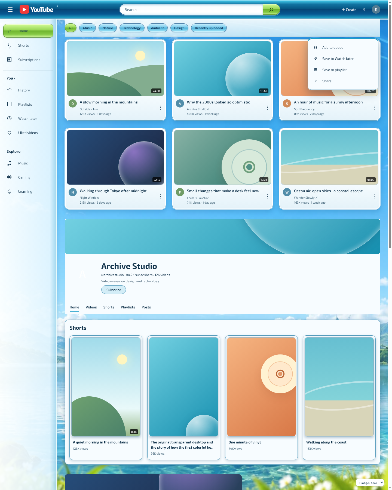
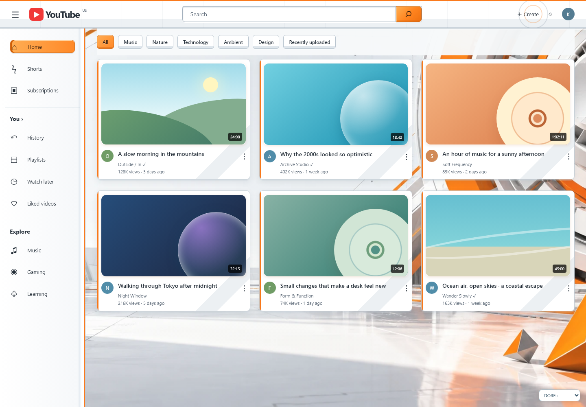
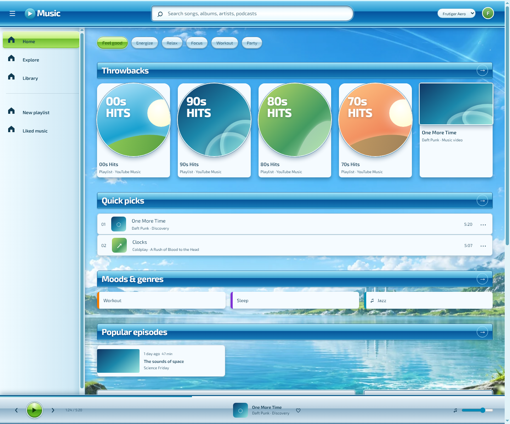
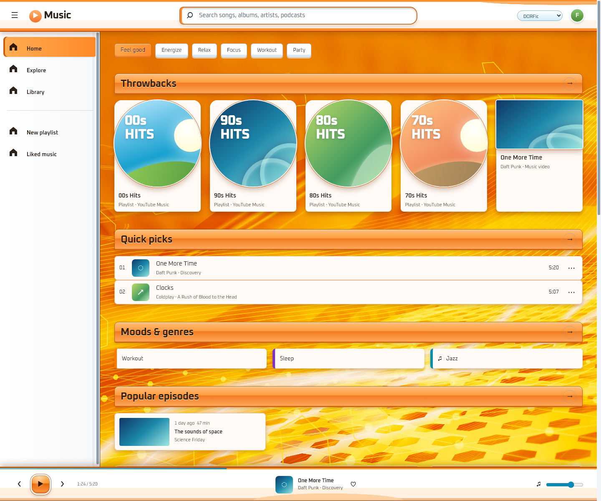
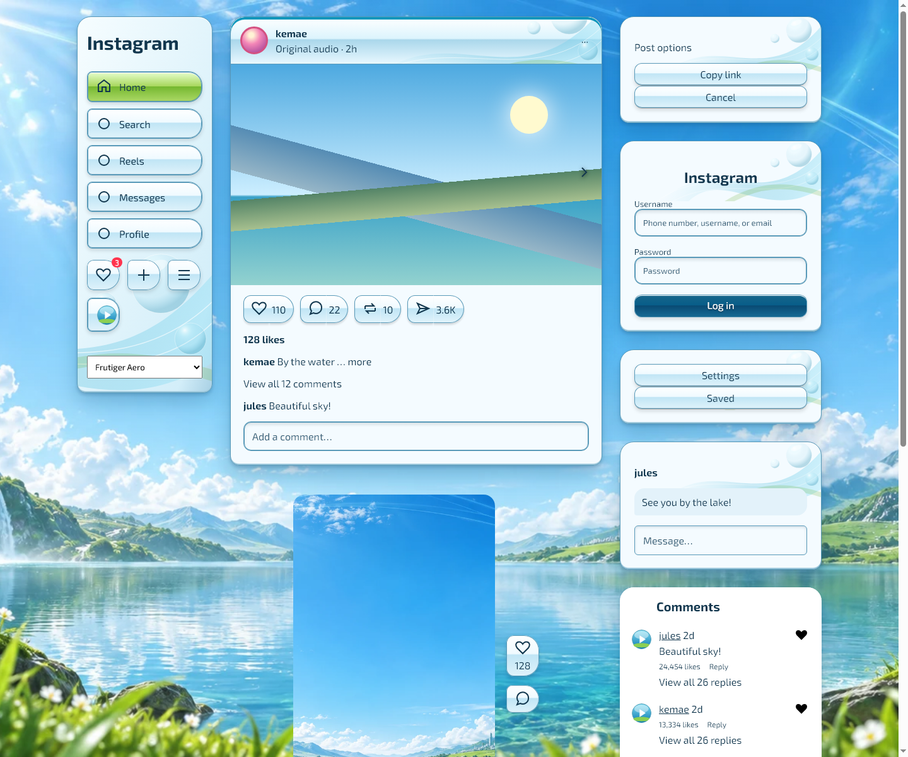
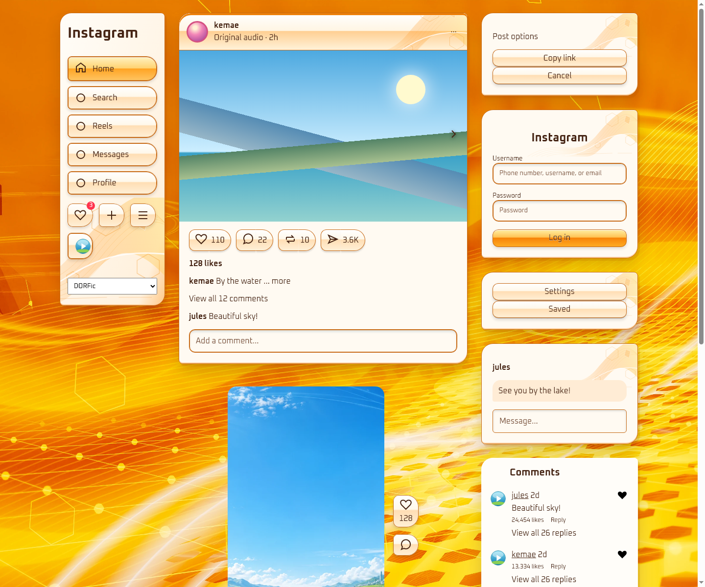
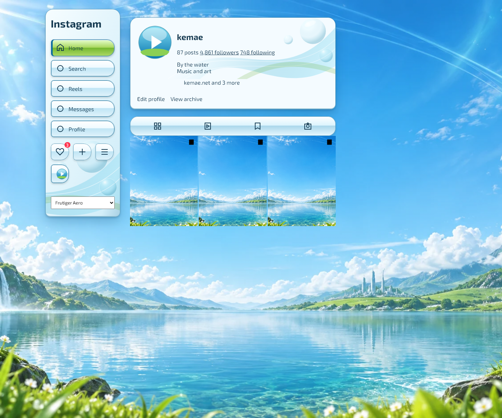
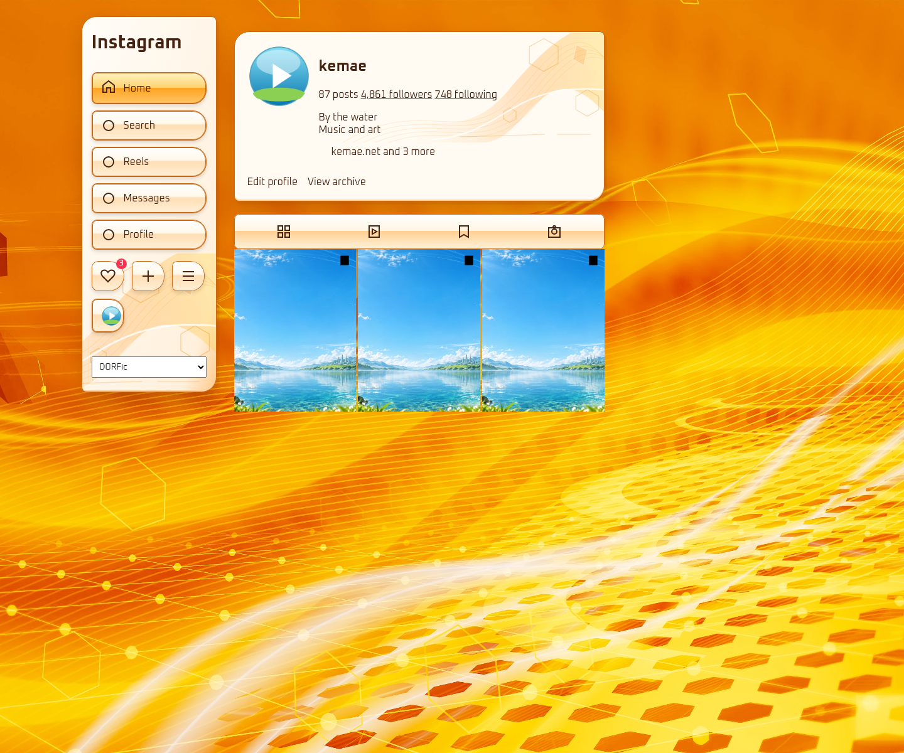
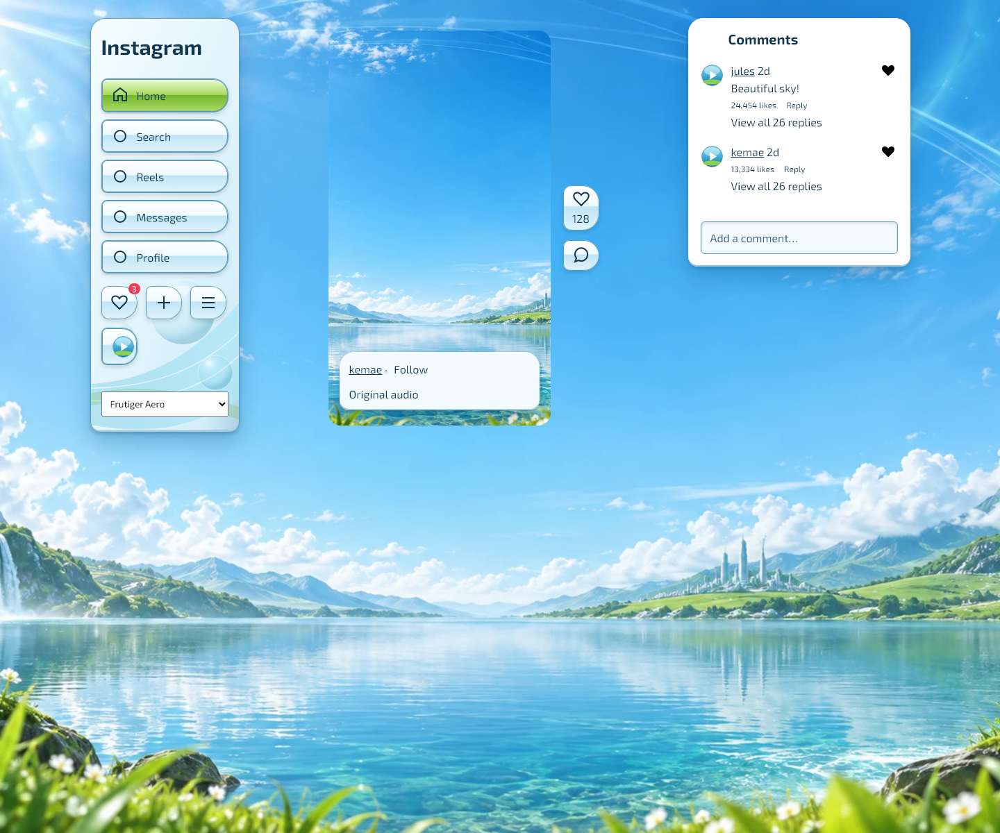
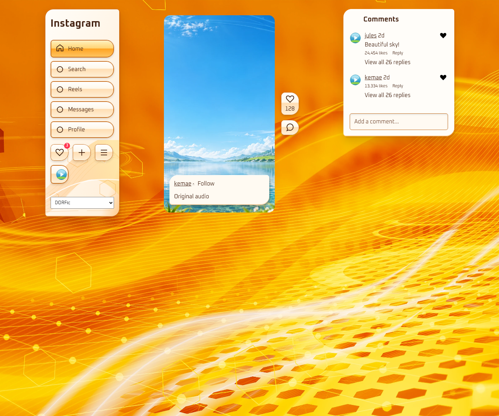

# Frutiger Web

A Chrome extension for YouTube, YouTube Music and Instagram.

- **Frutiger Aero** — Exo 2, sky/water scenery, blue chrome, green controls, beveled frames.
- **DORFic** — Oxanium, orange geometric wallpaper, white surfaces and angular controls.

Currently supports **YouTube** (`www.youtube.com`, `youtube.com`), **YouTube Music** (`music.youtube.com`) and **Instagram** (`www.instagram.com`, `instagram.com`). It themes the web versions of these services. One theme choice applies across supported sites, with a global on/off switch and independent switches for each site.

## Install in Google Chrome

1. Download or clone this repository and keep the folder somewhere permanent. If downloading the repository ZIP, extract it first.
2. Open `chrome://extensions`.
3. Turn on **Developer mode** in the upper-right corner.
4. Click **Load unpacked** and select this `frutiger-web` folder, which contains `manifest.json`.
5. Reload supported tabs opened before installation.
6. Click the extension's icon (pin it from Chrome's Extensions menu if desired), select **Frutiger Aero** or **DORFic**, and adjust the site switches.

Theme changes apply to all open supported tabs without reloading after installation. Turning the theme off removes the attribute that activates its styles and restores the site's own appearance. Selecting another theme while globally off saves that choice for when the theme is turned on again. After editing extension files, click **Reload** on its card in `chrome://extensions`, then reload supported tabs.

## Design previews

Open `apps/youtube/preview.html`, `apps/youtube-music/preview.html` or `apps/instagram/preview.html` in a browser to review the two themes and the off state. These are self-contained visual fixtures with representative site elements and local illustrations; they are not live service pages. A preview URL may use `?theme=frutiger`, `?theme=dorfic`, or `?theme=off`.

| | Frutiger Aero | DORFic |
| --- | --- | --- |
| YouTube |  |  |
| YouTube Music |  |  |
| Instagram |  |  |
| Instagram profile |  |  |
| Instagram Reels |  |  |

## Behavior and privacy

The extension uses Manifest V3, bundled stylesheets, and a small content script. Only Chrome's **storage** permission is requested. Site access is limited to the exact supported HTTPS hosts in the manifest. It stores only the enabled setting, selected theme, and site preferences locally. It makes no network requests and contains no analytics, account integration, remote code, or background service.

The content script sets a theme attribute on the document root after reading saved settings. CSS selectors are scoped to the selected theme and each site's attribute. The attribute remains in place during the site's normal navigation, so dynamically loaded pages receive the same theme. Site layouts, links, playback behavior, video images and thumbnails are preserved; the native video player keeps its dark control surface. Chrome-managed UI, cross-origin frames, and content inside inaccessible shadow roots are not themed.

Supported sites change their markup and run layout experiments, so some less-common surfaces may retain native colors or require a selector update. The design fixtures do not guarantee every live-site surface. These are independent visual themes, not official YouTube or Instagram products. Instagram uses native color tokens and semantic content, navigation, form and menu surfaces. Its local adapter annotates existing text blocks and controls, exposes wallpaper around Reels players, and lightens comment panels. It adds no text or elements, reads no input values, and removes its markers when disabled; video and image colors remain unchanged. Its signed-out markup was inspected, but signed-in feed, inbox and profile layouts still need an installed-extension check.

Version 1.5.1 corrects Instagram's native sibling action rows: every icon and separately clickable count joins into one capsule without moving React nodes. SVG accessibility titles no longer interfere with count detection. Compact sidebar icons are centered through their padded native wrappers. Nested profile headers with `#` statistic links receive one shared panel; biographies, links and actions remain unboxed inside it. Profile media links with Clip overlays keep their original grid geometry. Post options and caption More controls are unframed. Docked DIV-based comment panes use bright white/ivory surfaces, and likes, replies, reply expansion and heart controls stay unboxed. Tests cover these native markup shapes in both themes, including compact navigation and dynamic/off-state cleanup. Public profile and Reel action markup was inspected on live Instagram; signed-in layouts still require an installed-extension check. The earlier Music padding, Playables contrast and Shorts backdrop fixes remain included.

Version 1.4.0 adds individual Instagram text boxes, bubbles for native DIV icon controls, circular profile frames, Reels wallpaper, and brighter comment surfaces in both themes. The adapter also covers newly mounted content and restores native appearance when disabled.

Version 1.3.0 preserves Music's immersive content wrapper instead of hiding its entire home page. Search results, playlist headers, artist/album columns and durations now receive readable text colors, including the shared row structure used by Liked Music. Instagram adds local vector chrome, beveled navigation and reading-area controls, aligned panel corners and opaque text surfaces in both themes.

## Add another theme

1. Add a new theme's `id` and `name` to `registry.js` under `themes`. Optionally add a local `wallpaper` path. The popup reads this list automatically. Add a wallpaper to the manifest's web-accessible resources and a scoped background rule in `wallpaper.css`.
2. Create `apps/<site-id>/theme-<theme-id>.css` for every supported site. Scope **every selector** to that site's root attribute and the new theme ID, for example `html[data-yt-tube-theme="my-theme"] ytd-masthead`.
3. Add those stylesheet paths to the appropriate `content_scripts[].css` arrays in `manifest.json`. Chrome does not discover stylesheets from the registry; this manifest update is required.
4. Add the stylesheets to the local previews, reload the extension in Chrome, and verify theme selection, off restoration, navigation, contrast, and player controls.

## Add another website or web app

1. Add a `sites` entry in `registry.js` with a unique `id`, display `name`, exact `hosts`, and a unique root `attribute`.
2. Create its module folder `apps/<site-id>/` and scoped CSS for each registered theme.
3. Add a separate manifest `content_scripts` entry with explicit HTTPS match patterns for those hosts, `registry.js` and `content.js`, that site's theme CSS files, and the shared `wallpaper.css`, `fonts/extension.css` and `fonts.css`. Also add the exact hosts to the wallpaper/font resources' match list. Avoid broad/all-sites matches. Adding a host in the registry alone does not authorize injection; **the manifest must also be updated**.
4. Supply a representative local preview and check the live website. The shared popup automatically adds the site's switch, and the content script automatically chooses its module by hostname. New sites default to enabled.

The shared settings object is `{ enabled: true, theme: "frutiger", apps: { youtube: true, "youtube-music": true, instagram: true } }`. The `apps` key stores website/web-app switches for compatibility; it does not imply support for native desktop applications.

## Files

- `registry.js` — the theme and supported-site metadata.
- `content.js` — saved preferences, site detection, scoped root attributes, and popup status.
- `popup.html`, `popup.css`, `popup.js` — global appearance and supported-site controls.
- `apps/` — independent site styles and local design previews.
- `refinements.css` — shared Music spacing, Playables metadata/control colors and Shorts backdrop corrections.
- `icons/` — local PNG icons in Chrome's 16, 32, 48 and 128 pixel sizes.
- `assets/` and `wallpaper.css` — bundled scenery and shared background styling; [artwork and research notes](assets/SOURCES.md).
- `fonts/` and `fonts.css` — bundled Exo 2 and Oxanium, their licenses, and scoped typography. Fonts load locally without external requests.
- `create-icons.ps1` — optional local icon-generation source using Windows System.Drawing.

No build step or package installation is needed.

## Verification

Run `node tools/verify-extensions.cjs` for manifest, host scope, local file references, JavaScript syntax, and icon dimensions. Run `node --test tools/test-content.cjs tools/test-popup.cjs` for saved preferences, supported hosts, theme switching, per-site and global off, loading races, popup controls, errors, and unsupported-host behavior.

Run `node tools/test-rendering.cjs` with Chrome or Edge installed to check browser rendering against native-style labels and stretched chips. It verifies contrast, packaged fonts, opaque watch/comment panels, Shorts playback overlays, reply toggling, Music genres/episodes/Related tabs, compact filters, artwork shapes, shadows, Instagram content/forms/menus, media colors and off restoration. Add `--screenshots` to refresh the feed screenshots above. Test profiles and reports remain under ignored `.qa/`.

Sidebar checks exercise expanded and compact Music guides, including mounted hidden panels and native SVG icons. Use `--site=youtube-music --width=960 --guide=compact` for a narrower layout or `--site=youtube-music --guide=fullscreen` to verify the guide stays hidden during fullscreen. Comment checks cover transparent inner replies and circular avatar wrappers; Instagram checks verify that canvas layers expose the wallpaper while posts remain opaque.

Music home checks reproduce the live site's `.background-gradient > #content-wrapper` nesting and immersive attributes. Search and playlist checks start with native white nested links, metadata, owner names and fixed duration columns. Instagram checks include media colors, menu/inbox surfaces, nested button text, header corners, keyboard focus and horizontal overflow. Use `--site=instagram --width=600` for the narrow fixture. Add `--view=reels` or `--view=profile` for the separate Reels/profile views, and `--screenshots` to refresh its images. Instagram checks also cover grouped action counts, unboxed general text/arrows/tabs, roomy sidebar hover geometry, single profile/caption panels, late-loaded content and off cleanup. Music checks verify reading insets; YouTube checks include Playables contrast and late-mounted Shorts ambient layers.

The previews use the actual theme stylesheets against representative local markup. Their layouts are illustrative. The source package has been checked with these fixtures and behavioral tests; it still needs an installed-extension check against live signed-in pages for account-specific layouts and playback.

The manifest follows the official [Chrome content scripts documentation](https://developer.chrome.com/docs/extensions/reference/manifest/content-scripts).
